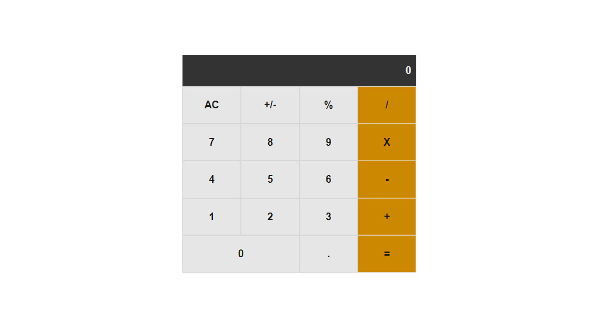
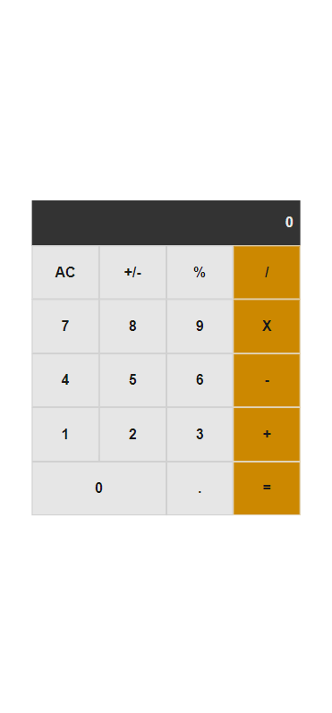

# Math-Magic
"Math-magic" is a website for all fans of mathematics. It is a Single Page App (SPA) that allows users to:
 - Make simple calculations.
 - Read a random math-related quote.
  
## Live Demo

[Live Demo Link](https://m0rrighan.github.io/math-magic/)

## Screenshots
### Desktop

### Mobile

## Built With

- HTML
- CSS
- React.JS

## Getting Started

**To clone this project run command:**
```
$git clone https://github.com/M0rrighan/math-magic.git
```
**or press the green Code button in the upper right corner and choose to download from the Download ZIP link.**

### Install

```cmd
npm install
```

### Usage

```cmd
npm start
```

## Prerequisites

- Code editor (VS Code, Sublime, Atom)
- Node.JS

## Authors

👤 **Author1**

- GitHub: [@M0rrighan](https://github.com/M0rrighan)
- Twitter: [@RadmilaStojceva](https://twitter.com/RadmilaStojceva)
- LinedIn: [@Radmila Stojceva](https://www.linkedin.com/in/radmila-stojceva-71a838212)

## Show your support

Give a ⭐️ if you like this project!

## 📝 License

This project is [MIT](./MIT.md) licensed.
